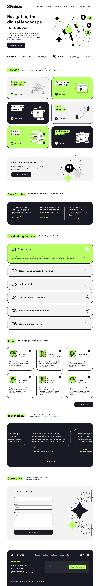

# Positivus - Landing Page



## Descrição
A **Positivus** é uma landing page moderna e responsiva, projetada para destacar serviços de marketing digital. 
Ela foi desenvolvida utilizando **React.js (Vite), TypeScript e Tailwind CSS**, garantindo alta performance, tipagem segura e um design estiloso e responsivo.

## Tecnologias Utilizadas
- **React.js (Vite)** - Framework para construção da interface
- **TypeScript** - Superset do JavaScript para tipagem estática
- **Tailwind CSS** - Framework CSS utilitário para estilização

## Estrutura do Projeto
```
LandingPagesPositivus/
│-- src/
│   ├── components/   # Componentes reutilizáveis
│   ├── pages/        # Páginas principais
│   ├── assets/       # Imagens e recursos estáticos
│   ├── App.tsx       # Componente principal
│   ├── main.tsx      # Ponto de entrada do aplicativo
│-- public/           # Arquivos públicos
│-- package.json      # Configuração do projeto e dependências
│-- tailwind.config.js # Configuração do Tailwind CSS
│-- tsconfig.json     # Configuração do TypeScript
│-- vite.config.ts    # Configuração do Vite
```

## Instalação e Execução

1. Clone o repositório:
   ```sh
   git clone https://github.com/marconesdb/PositivusLandinpage
   ```

2. Acesse o diretório do projeto:
   ```sh
   cd LandingPagesPositivus
   ```

3. Instale as dependências:
   ```sh
   npm install
   ```

4. Inicie o servidor de desenvolvimento:
   ```sh
   npm run dev
   ```

5. Acesse no navegador: [http://localhost:5173](http://localhost:5173)

## Autor
- **Marcone Silva de Brito**
- [Portfólio](#) *(https://layout-novo-portfolio.vercel.app/)*
- [Figma](#) *(https://www.figma.com/community/file/1230604708032389430)*


## Licença
Este projeto é licenciado sob a **MIT License**. Sinta-se livre para usá-lo e modificá-lo conforme necessário.

---
Desenvolvido com 💚 por Marcone Silva de Brito 🚀
